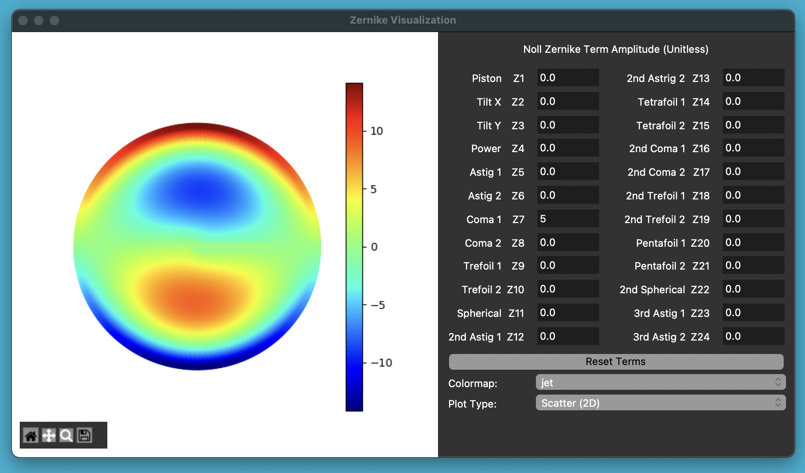
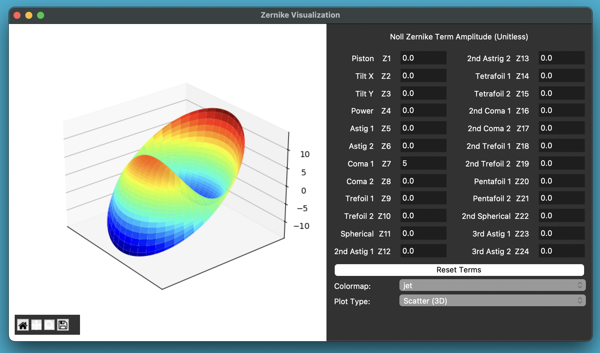

# Zernike Visualization

Michael Jones (Michael_Jones6@student.uml.edu)

This is a tool to visualize Zernike Polynomial combinations (up through the first 24).

## Installation

The following Conda command will create the environment and install the necessary dependencies:

    conda env create -f environment.yml

Then, to activate the environment:

    conda activate zernike

If the dependencies change at any point, the `environment.yml` can be updated via:

    conda env export --no-builds | grep -v "^prefix: " > environment.yml

## Running Script

Navigate to the `src` folder and run `python3 main.py`.
This will open an interactive GUI.

Currently supports 2D and 3D plots:

## Noll Zernike Indices

The Zernike terms are represented using Noll Indices.
More information can be found at the link below.

https://en.wikipedia.org/wiki/Zernike_polynomials#Noll's_sequential_indices

## Note on Precision

To improve performance, only incremental updates are made to the plots.
Due to this, sometimes precision errors occur.
When this happens, simply click the `Reset Terms` button.
